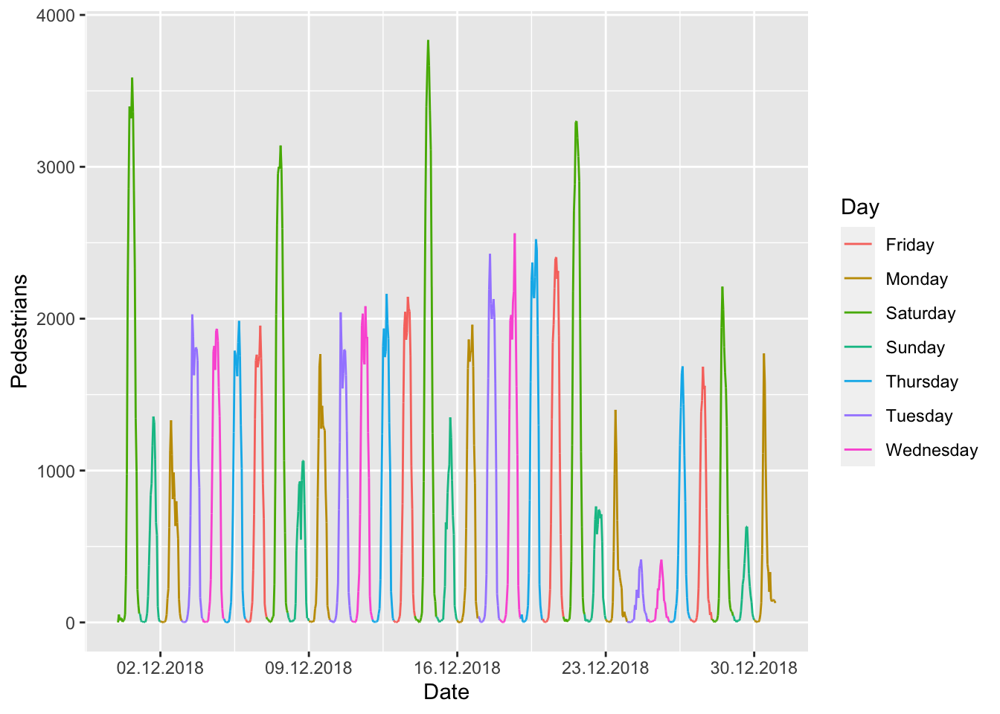
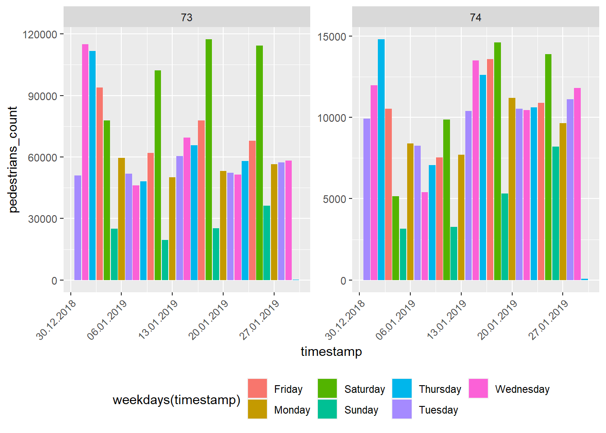
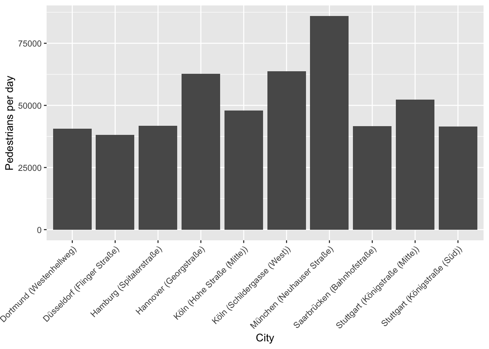

<!-- README.md is generated from README.Rmd. Please edit that file -->

# hystReet

[](http://www.repostatus.org/#active)

## Introduction

[hystreet](https://hystreet.com) is a company collecting pedestrains in
german cities. After registering you can download the data for free from
19 cities.

## Installation

Until now the package is not on CRAN but you can download it via GitHub
with the following command:

``` r
if (!require("devtools"))
  install.packages("devtools")
devtools::install_github("JohannesFriedrich/hystReet")
```

## API Keys

To use this package, you will first need to get your hystreet API key.
To do so, go to this link: <https://hystreet.com/>

Now you have three options:

1)  
Once you have your key, save it as an environment variable for the
current session by running the following:

``` r
Sys.setenv(HYSTREET_API_TOKEN = "PASTE YOUR API TOKEN HERE")
```

2)  Alternatively, you can set it permanently with the help of
    `usethis::edit_r_environ()` by adding the line to your `.Renviron`:

<!-- end list -->

    HYSTREET_API_TOKEN = PASTE YOUR API TOKEN HERE

3)  If you don’t want to save it here, you can input it in each function
    using the `API_token`
parameter.

## Usage

| Function name                  | Description                                          | Example                          |
| ------------------------------ | ---------------------------------------------------- | -------------------------------- |
| get\_hystreet\_stats()         | request common statistics about the hystreet project | get\_hystreet\_stats()           |
| get\_hystreet\_locations()     | request all qvailable locations                      | get\_hystreet\_locations()       |
| get\_hystreet\_station\_data() | request data from a stations                         | get\_hystreet\_station\_data(71) |
| set\_hystreet\_token()         | set your API token                                   | set\_hystreet\_token(123456789)  |

### Load some statistics

The function ‘get\_hystreet\_stats()’ summarises the number of available
stations and the sum of all counted pedestrians.

``` r
library(hystReet)
## Loading required package: httr
## Loading required package: jsonlite
## 
## Attaching package: 'jsonlite'
## The following object is masked from 'package:purrr':
## 
##     flatten

stats <- get_hystreet_stats()
```

``` r
stats
```

<table>

<thead>

<tr>

<th style="text-align:right;">

stations

</th>

<th style="text-align:right;">

today\_count

</th>

</tr>

</thead>

<tbody>

<tr>

<td style="text-align:right;">

110

</td>

<td style="text-align:right;">

272711

</td>

</tr>

</tbody>

</table>

### Request all stations

The function ‘get\_hystreet\_locations()’ requests all available
stations of the project.

``` r
locations <- get_hystreet_locations()
```

``` r
locations
```

<table>

<thead>

<tr>

<th style="text-align:right;">

id

</th>

<th style="text-align:left;">

name

</th>

<th style="text-align:left;">

city

</th>

</tr>

</thead>

<tbody>

<tr>

<td style="text-align:right;">

209

</td>

<td style="text-align:left;">

Lange Straße

</td>

<td style="text-align:left;">

Oldenburg

</td>

</tr>

<tr>

<td style="text-align:right;">

151

</td>

<td style="text-align:left;">

Stiftstraße

</td>

<td style="text-align:left;">

Stuttgart

</td>

</tr>

<tr>

<td style="text-align:right;">

168

</td>

<td style="text-align:left;">

Hohe Straße (Nord)

</td>

<td style="text-align:left;">

Köln

</td>

</tr>

<tr>

<td style="text-align:right;">

93

</td>

<td style="text-align:left;">

Große Bleichen

</td>

<td style="text-align:left;">

Hamburg

</td>

</tr>

<tr>

<td style="text-align:right;">

135

</td>

<td style="text-align:left;">

Schönbornstraße

</td>

<td style="text-align:left;">

Würzburg

</td>

</tr>

<tr>

<td style="text-align:right;">

131

</td>

<td style="text-align:left;">

Sack

</td>

<td style="text-align:left;">

Braunschweig

</td>

</tr>

<tr>

<td style="text-align:right;">

142

</td>

<td style="text-align:left;">

Hauptstraße (Süd)

</td>

<td style="text-align:left;">

Erlangen

</td>

</tr>

<tr>

<td style="text-align:right;">

89

</td>

<td style="text-align:left;">

Kaiserstraße

</td>

<td style="text-align:left;">

Nürnberg

</td>

</tr>

<tr>

<td style="text-align:right;">

160

</td>

<td style="text-align:left;">

Schildergasse (Ost)

</td>

<td style="text-align:left;">

Köln

</td>

</tr>

<tr>

<td style="text-align:right;">

57

</td>

<td style="text-align:left;">

Schlösserstraße

</td>

<td style="text-align:left;">

Erfurt

</td>

</tr>

</tbody>

</table>

### Request data from a specific station

The (probably) most interesting function is
‘get\_hystreet\_station\_data()’. With the hystreetID it is possible
to request a specific station. By default, all the data from the current
day are received. With the ‘query’ argument it is possible to set the
received data more precise: \* from: datetime of earliest measurement
(default: today 00:00:00:): e.g. “2018-10-01 12:00:00” or “2018-10-01”
\* to : datetime of latest measurement (default: today 23:59:59): e.g.
“2018-12-01 12:00:00” or “2018-12-01” \* resoution: Resultion for the
measurement grouping (default: hour): “day”, “hour”, “month”, “week”

``` r
data <- get_hystreet_station_data(
  hystreetId = 71,
  query = list(from = "2018-12-01", to = "2018-12-31", resolution = "day"))
```

## Some ideas to visualise the data

Let´s see if we can see the most frequent days before christmas … I
think it could be saturday ;-). Also nice to see the 24th and 25th of
December … holidays in Germany :-).

``` r
data <- get_hystreet_station_data(
    hystreetId = 71, 
    query = list(from = "2018-12-01", to = "2019-01-01", resolution = "hour"))
```

``` r
ggplot(data$measurements, aes(x = timestamp, y = pedestrians_count, colour = weekdays(timestamp))) +
  geom_path(group = 1) +
  scale_x_datetime(date_breaks = "7 days") +
  scale_x_datetime(labels = date_format("%d.%m.%Y")) +
  labs(x = "Date",
       y = "Pedestrians",
       colour = "Day")
## Scale for 'x' is already present. Adding another scale for 'x', which will
## replace the existing scale.
```



### Compare different stations

Now let´s compare different stations:

1)  Load the data

<!-- end list -->

``` r
data_73 <- get_hystreet_station_data(
    hystreetId = 73, 
    query = list(from = "2019-01-01", to = "2019-01-31", resolution = "day"))$measurements %>% 
  select(pedestrians_count, timestamp) %>% 
  mutate(station = 73)

data_74 <- get_hystreet_station_data(
    hystreetId = 74, 
    query = list(from = "2019-01-01", to = "2019-01-31", resolution = "day"))$measurements %>% 
    select(pedestrians_count, timestamp) %>% 
  mutate(station = 74)

data <- bind_rows(data_73, data_74)
```

``` r
ggplot(data, aes(x = timestamp, y = pedestrians_count, fill = weekdays(timestamp))) +
  geom_bar(stat = "identity") +
  scale_x_datetime(labels = date_format("%d.%m.%Y")) +
  facet_wrap(~station, scales = "free_y") +
  theme(legend.position = "bottom",
        axis.text.x = element_text(angle = 45, hjust = 1))
```



### Highest ratio (pedestrians/day)

Now a little bit of big data analysis. Let´s find the station with the
highest pedestrians per day ratio:

``` r
hystreet_ids <- get_hystreet_locations()

all_data <- lapply(hystreet_ids[,"id"], function(x){
  temp <- get_hystreet_station_data(
    hystreetId = x)
  
  
    lifetime_count <- temp$statistics$lifetime_count
    days_counted <- as.numeric(temp$metadata$latest_measurement_at  - temp$metadata$earliest_measurement_at)
    
    return(data.frame(
      id = x,
      station = paste0(temp$city, " (",temp$name,")"),
      ratio = lifetime_count/days_counted))
  
})

ratio <- bind_rows(all_data)
```

What stations have the highest ratio?

``` r
ratio %>% 
  top_n(5, ratio) %>% 
  arrange(desc(ratio))
##    id                       station    ratio
## 1 165     München (Kaufingerstraße) 92893.67
## 2 131           Braunschweig (Sack) 89040.85
## 3  73    München (Neuhauser Straße) 88615.60
## 4 150 Frankfurt a.M. (Zeil (Mitte)) 66732.31
## 5 159  Köln (Schildergasse (Mitte)) 63316.30
```

Now let´s visualise the top 10 cities:

``` r
ggplot(ratio %>% 
         top_n(10,ratio), aes(station, ratio)) +
  geom_bar(stat = "identity") +
  labs(x = "City",
       y = "Pedestrians per day") + 
    theme(legend.position = "bottom",
        axis.text.x = element_text(angle = 45, hjust = 1))
```


