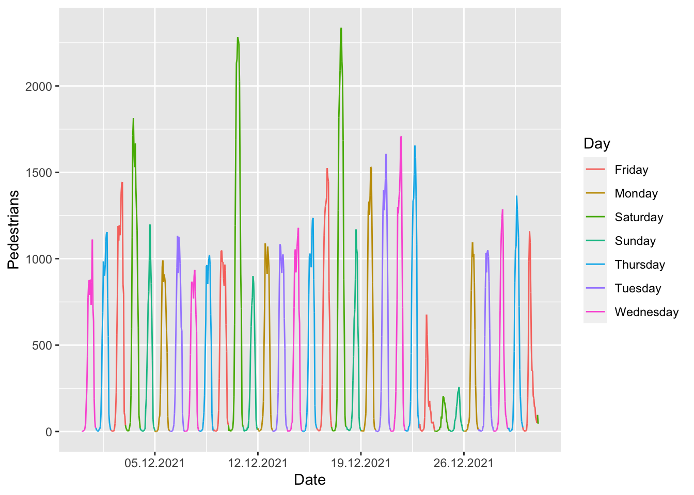
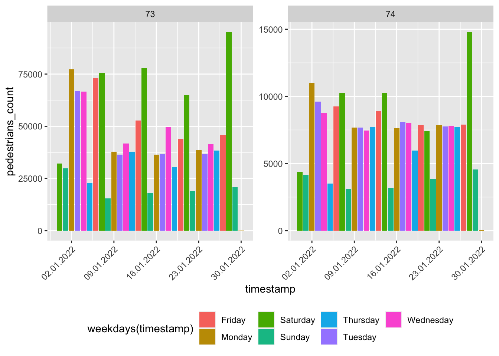
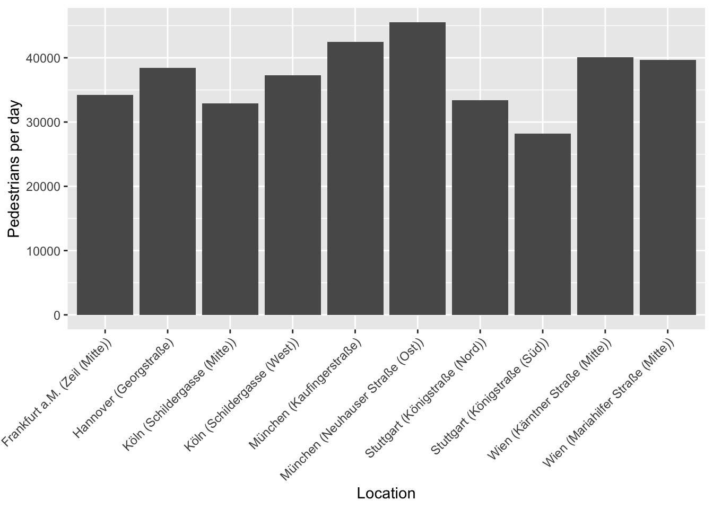
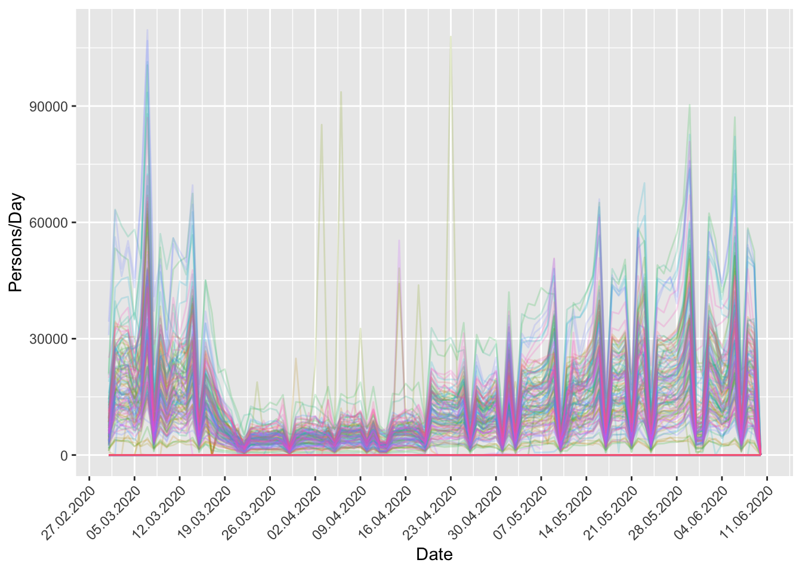

<!-- README.md is generated from README.Rmd. Please edit that file -->

# hystReet

<!-- badges: start -->

[](https://CRAN.R-project.org/package=hystReet)
[](https://www.r-pkg.org/pkg/hystReet)
[](https://travis-ci.org/JohannesFriedrich/hystReet)
[](https://ci.appveyor.com/project/JohannesFriedrich/hystreet)
[](https://github.com/JohannesFriedrich/hystReet/actions)
[](http://www.repostatus.org/#active)
<!-- badges: end -->

## Introduction

[hystreet](https://hystreet.com) is a company that collects data on
pedestrian traffic in shopping streets of different German cities. After
registering you can access and download the data via their website.

## Installation

The package is now on CRAN. The easiest way to download is via:

``` r
install.packages("hystReet")
```

You can install the development version from GitHub with the following
command:

``` r
if (!require("devtools"))
  install.packages("devtools")
devtools::install_github("JohannesFriedrich/hystReet")
```

## API Keys

To use this package, you will first need to get a hystreet API key. To
do so, you first need to set up an account on <https://hystreet.com/>.
After that you can request an API key via
[e-mail](mailto:info@hystreet.com). Once your request has been granted,
you will find you key in your hystreet account profile.

Now you have three options:

1)  Once you have your key, you can save it as an environment variable
    for the current session by running the following command:

``` r
Sys.setenv(HYSTREET_API_TOKEN = "PASTE YOUR API TOKEN HERE")
```

2)  Alternatively, you can set it permanently with the help of
    `usethis::edit_r_environ()` by adding the following line to your
    `.Renviron`:

<!-- -->

    HYSTREET_API_TOKEN = PASTE YOUR API TOKEN HERE

3)  If you don’t want to save your API token here, you can enter it for
    each function of this package using the `API_token` parameter.

## Usage

| Function name               | Description                                          | Example                       |
|-----------------------------|------------------------------------------------------|-------------------------------|
| get_hystreet_stats()        | request common statistics about the hystreet project | get_hystreet_stats()          |
| get_hystreet_locations()    | request all available locations                      | get_hystreet_locations()      |
| get_hystreet_station_data() | request data from a stations                         | get_hystreet_station_data(71) |
| set_hystreet_token()        | set your API token                                   | set_hystreet_token(123456789) |

### Load some statistics

The function `get_hystreet_stats()` summarises the number of available
stations and the sum of all counted pedestrians.

``` r
library(hystReet)
## Loading required package: httr
## Loading required package: jsonlite
## 
## Attaching package: 'jsonlite'
## The following object is masked from 'package:purrr':
## 
##     flatten

stats <- get_hystreet_stats()
```

``` r
stats
```

<table>
<thead>
<tr>
<th style="text-align:right;">
stations
</th>
<th style="text-align:right;">
today_count
</th>
</tr>
</thead>
<tbody>
<tr>
<td style="text-align:right;">
188
</td>
<td style="text-align:right;">
2260884
</td>
</tr>
</tbody>
</table>

### Request all stations

The function `get_hystreet_locations()` generates a data frame with all
available stations of the project.

``` r
locations <- get_hystreet_locations()
```

``` r
locations
```

<table>
<thead>
<tr>
<th style="text-align:right;">
id
</th>
<th style="text-align:left;">
name
</th>
<th style="text-align:left;">
city
</th>
</tr>
</thead>
<tbody>
<tr>
<td style="text-align:right;">
308
</td>
<td style="text-align:left;">
Leipziger Straße (West)
</td>
<td style="text-align:left;">
Halle (Saale)
</td>
</tr>
<tr>
<td style="text-align:right;">
76
</td>
<td style="text-align:left;">
Königstraße (Mitte)
</td>
<td style="text-align:left;">
Stuttgart
</td>
</tr>
<tr>
<td style="text-align:right;">
351
</td>
<td style="text-align:left;">
Johann-Philipp-Straße
</td>
<td style="text-align:left;">
Trier
</td>
</tr>
<tr>
<td style="text-align:right;">
108
</td>
<td style="text-align:left;">
Große Straße (Mitte)
</td>
<td style="text-align:left;">
Osnabrück
</td>
</tr>
<tr>
<td style="text-align:right;">
309
</td>
<td style="text-align:left;">
Hochstraße (Nord)
</td>
<td style="text-align:left;">
Krefeld
</td>
</tr>
<tr>
<td style="text-align:right;">
140
</td>
<td style="text-align:left;">
Fleischstraße (Nord)
</td>
<td style="text-align:left;">
Trier
</td>
</tr>
<tr>
<td style="text-align:right;">
53
</td>
<td style="text-align:left;">
Schadowstraße (West)
</td>
<td style="text-align:left;">
Düsseldorf
</td>
</tr>
<tr>
<td style="text-align:right;">
55
</td>
<td style="text-align:left;">
Flinger Straße (Ost)
</td>
<td style="text-align:left;">
Düsseldorf
</td>
</tr>
<tr>
<td style="text-align:right;">
348
</td>
<td style="text-align:left;">
Holstenstraße (Nord)
</td>
<td style="text-align:left;">
Kiel
</td>
</tr>
<tr>
<td style="text-align:right;">
368
</td>
<td style="text-align:left;">
Marktstraße
</td>
<td style="text-align:left;">
Mönchengladbach
</td>
</tr>
</tbody>
</table>

### Request data from a specific station

The (probably) most interesting function is
`get_hystreet_station_data()`. Using the hystreetID it is possible to
request a specific station. By default, all the data from the current
day are received. With the `query` argument it is possible to define the
time and sampling frame of the data more precisely:

-   `from`: datetime of earliest measurement (default: today 00:00:00:):
    e.g. “2021-10-01 12:00:00” or “2021-10-01”
-   `to` : datetime of latest measurement (default: today 23:59:59):
    e.g. “2021-12-01 12:00:00” or “2021-12-01”
-   `resoution`: Resolution for the measurement (default: hour): “day”,
    “hour”, “month”, “week”

``` r
data <- get_hystreet_station_data(
  hystreetId = 71,
  query = list(from = "2021-12-01", to = "2021-12-31", resolution = "day"))
```

## Some ideas for visualising the data

Let´s see if we can find the busiest days in December 2021. Saturdays
were probably quite busy, while there should have been substantially
less pedestrian traffic on the 25th and 26th of December, both of which
are holidays in Germany.

``` r
data <- get_hystreet_station_data(
    hystreetId = 71, 
    query = list(from = "2021-12-01", to = "2022-01-01", resolution = "hour"))
```

``` r
ggplot(data$measurements, aes(x = timestamp, y = pedestrians_count, colour = weekdays(timestamp))) +
  geom_path(group = 1) +
  scale_x_datetime(date_breaks = "7 days", labels = date_format("%d.%m.%Y")) +
  labs(x = "Date",
       y = "Pedestrians",
       colour = "Day")
```



### Compare different stations

Now let´s compare data from different stations:

1)  Load the data

``` r
data_73 <- get_hystreet_station_data(
    hystreetId = 73, 
    query = list(from = "2022-01-01", to = "2022-01-31", resolution = "day"))$measurements %>% 
  select(pedestrians_count, timestamp) %>% 
  mutate(station = 73)

data_74 <- get_hystreet_station_data(
    hystreetId = 74, 
    query = list(from = "2022-01-01", to = "2022-01-31", resolution = "day"))$measurements %>% 
    select(pedestrians_count, timestamp) %>% 
  mutate(station = 74)

data_73_74 <- bind_rows(data_73, data_74)
```

``` r
ggplot(data_73_74, aes(x = timestamp, y = pedestrians_count, fill = weekdays(timestamp))) +
  geom_bar(stat = "identity") +
  scale_x_datetime(labels = date_format("%d.%m.%Y")) +
  facet_wrap(~station, scales = "free_y") +
  theme(legend.position = "bottom",
        axis.text.x = element_text(angle = 45, hjust = 1))
```



### Highest ratio (pedestrians/day)

Now a little bit of big data analysis. Let´s find the station with the
highest pedestrians per day ratio:

``` r
hystreet_ids <- get_hystreet_locations()

all_data <- lapply(hystreet_ids[,"id"], function(ID){
  temp <- get_hystreet_station_data(
    hystreetId = ID,
    query = list(from = "2021-01-01", to = "2021-12-31", resolution = "day"))
  
  
    lifetime_count <- temp$statistics$timerange_count
    days_counted <- as.integer(ymd(temp$metadata$measured_to)  - ymd(temp$metadata$measured_from))
    
    return(data.frame(
      id = ID,
      station = paste0(temp$city, " (",temp$name,")"),
      ratio = lifetime_count/days_counted))
  
})

ratio <- bind_rows(all_data)
```

Which stations have the highest ratio?

``` r
ratio %>% 
  top_n(5, ratio) %>% 
  arrange(desc(ratio))
##    id                           station    ratio
## 1  73  München (Neuhauser Straße (Ost)) 45510.15
## 2 165         München (Kaufingerstraße) 42458.42
## 3 305    Wien (Kärntner Straße (Mitte)) 40067.34
## 4 306 Wien (Mariahilfer Straße (Mitte)) 39642.14
## 5  63            Hannover (Georgstraße) 38442.91
```

Now let´s visualise the top 10 locations:

``` r
ggplot(ratio %>% 
         top_n(10,ratio), aes(station, ratio)) +
  geom_bar(stat = "identity") +
  labs(x = "Location",
       y = "Pedestrians per day") + 
    theme(legend.position = "bottom",
        axis.text.x = element_text(angle = 45, hjust = 1))
```



### Corona effects

The Hystreet-API is a great source of analysing the social effects of
the Corona pandemic in 2020. Let´s collect all german stations since
March 2020 and analyse the pedestrian count until 10th June 2020.

``` r
data <- lapply(hystreet_ids[,"id"], function(ID){

    temp <- get_hystreet_station_data(
        hystreetId = ID,
        query = list(from = "2020-03-01", to = "2020-06-10", resolution = "day")
    )
    
    return(data.frame(
    name = temp$name,
    city = temp$city,
    timestamp = format(as.POSIXct(temp$measurements$timestamp), "%Y-%m-%d"),
    pedestrians_count = temp$measurements$pedestrians_count,
    legend = paste(temp$city, temp$name, sep = " - ")
  ))
   
}) 

data_all <- bind_rows(data)
```

``` r
data_all %>% 
ggplot(aes(ymd(timestamp), pedestrians_count, colour = legend)) +
geom_line(alpha = 0.2) +
    scale_x_date(labels = date_format("%d.%m.%Y"),
               breaks = date_breaks("7 days")
     ) +
  theme(legend.position = "none",
        legend.title = element_text("Legende"),
         axis.text.x = element_text(angle = 45, hjust = 1)) +
  labs(x = "Date",
       y = "Persons/Day")
```


